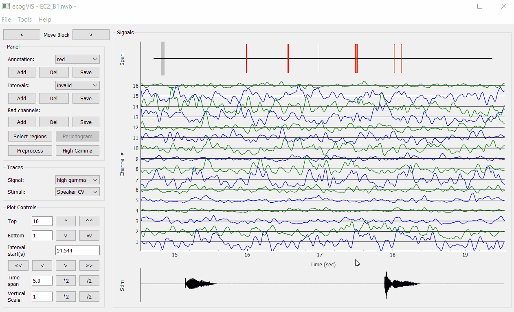
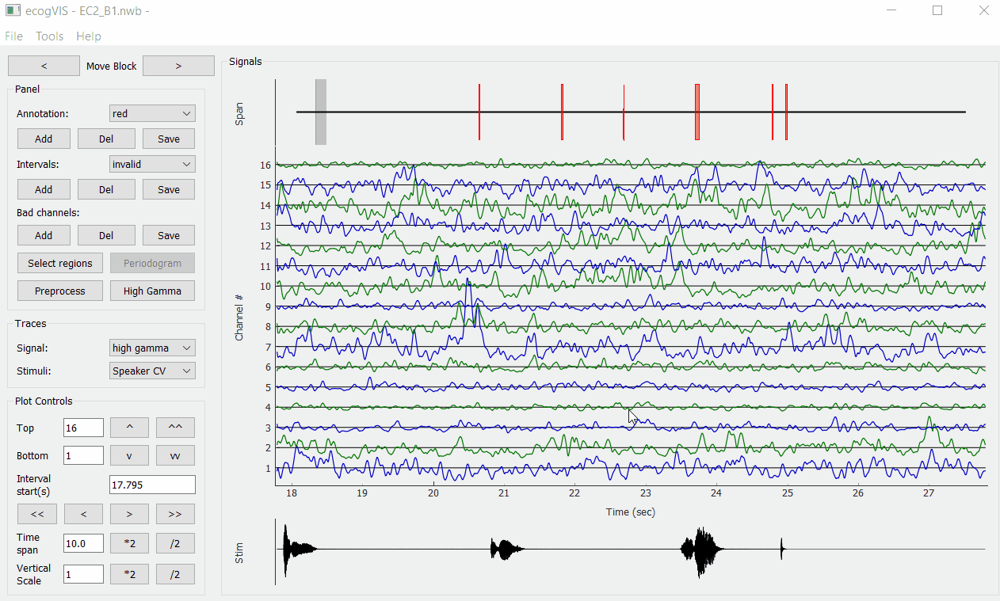
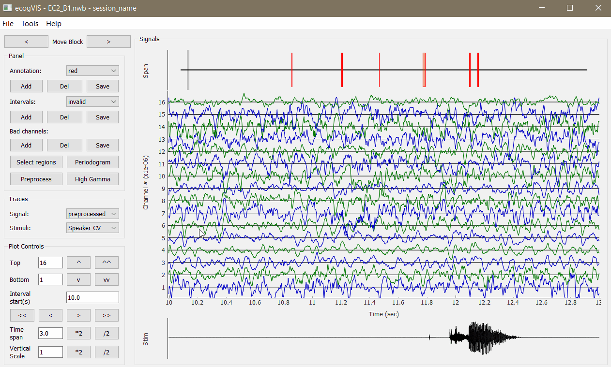
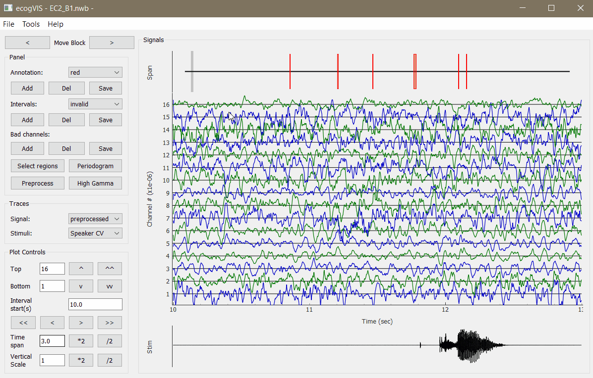

# ecogVIS
Timeseries visualizer for Electrocorticography (ECoG) signals stored in [NWB](https://neurodatawithoutborders.github.io/) files. 

## Installation
To clone the repository and set up a conda environment, do:
```
$ git clone https://github.com/bendichter/ecogVIS.git
$ conda env create -f ecogVIS/make_env.yml
$ source activate ecog_vis
```

Alternatively, to install **ecogVIS** directly in an existing environment:
```
$ pip install git+https://github.com/bendichter/ecogVIS.git
```

After activating the correct environment, **ecogVIS** can be imported and run from python. If the file does not exist (or if you provide an empty string ''), you'll be prompted to choose a file from a dialog.
```python
from ecogvis.ecogvis import main
import os

fpath = os.path.join('path_to','file.nwb')
main(fpath)
```


## Features
**ecogVIS** makes it intuitive and simple to viualize and process ECoG signals. It currently features:

### Navigation
Seamless visual navigation through long signals from large arrays of electrodes, by mouse-dragging visualization window, control buttons, value fields and keyboard keys.


### Annotations
Add, delete, save and load annotations for meaningful comments anywhere in the visualization.




### Intervals
Add, delete, save, load and create custom intervals types to mark specific points in time, with simple click-drag-release mouse movements.




### Bad Channels
Mark and un-mark bad channels. Choices are saved in the `electrodes` group of the current NWB file.


### Signal preprocessing
Preprocessing of raw voltage signals, including user-defined Downsampling, CAR and Notch filtering. The resulting processed signals are stored as an [LFP](https://pynwb.readthedocs.io/en/stable/pynwb.ecephys.html#pynwb.ecephys.LFP) object, in the `processing` group of the current NWB file.


### Event detection
Automatic detection of events in audio recordings for Consonant-Vowel tasks. The audio data should be stored in the NWB file in the following way: 
- Speaker audio - As a [TimeSeries](https://pynwb.readthedocs.io/en/stable/pynwb.base.html#pynwb.base.TimeSeries) object, named 'Speaker CV', in the `stimulus` group. 
- Microphone audio - As a [TimeSeries](https://pynwb.readthedocs.io/en/stable/pynwb.base.html#pynwb.base.TimeSeries) object, named 'Microphone CV', in the `acquisition` group.

The resulting detected intervals, 'TimeIntervals_mic' and 'TimeIntervals_speaker', are saved as [TimeIntervals](https://pynwb.readthedocs.io/en/stable/pynwb.epoch.html#pynwb.epoch.TimeIntervals) objects in the `intervals` group of the current NWB file and can be used later for ERP analysis. A preview allows for testing of the detection parameters before running it for the whole duration of the audio signals. 




### High Gamma
Estimation of high gamma analytic amplitude, with the average of user-defined specific bands. The results are saved as a [TimeSeries](https://pynwb.readthedocs.io/en/stable/pynwb.base.html#pynwb.base.TimeSeries) object, named 'high_gamma', in the `processing` group of the current or of a new NWB file.




### Event-Related Potentials
Grid visualization of high gamma ERP calculated in reference to:
- Stimulus (speaker) or response (microphone) time intervals
- Onset or offset points 

The grid items are coloured to mark specific cortical areas and can be rotated to correspond anatomically to them. Emphasis can be given to specific areas of interest and double-clicking an item allows for fast inspection of the single electrode's ERP in detail.


### Periodograms
Grid visualization of Periodograms.


### Plus
- Select electrodes from specific brain areas
- Easy moving between block files for the same subject
- Spectral Decomposition
